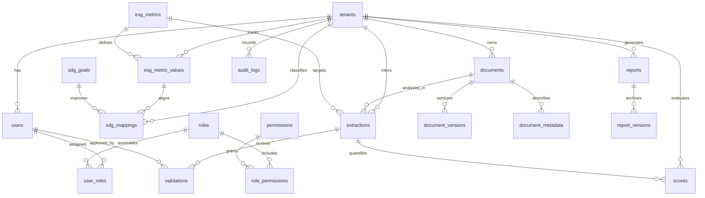

# CorpStage Enterprise Database Entity-Relationship Diagram (ERD)

This directory documents the structural data models designed for the **CorpStage Multi-Tenant SaaS platform**. The architecture employs a **bridged shared-database, isolated-schema** model enabling strict multi-tenant Row-Level Security (RLS).

---

## 🏛️ Entity Relationship Diagram (Mermaid)

The following diagram defines the physical mapping tables, cascading bounds, and multi-tenant isolation keys. All tenant-specific entities carry a `tenant_id` foreign key referencing the central `tenants` catalog.

---

## 🗂️ Table Taxonomy and Physical Dictionary

### 1. Tenant Management
* **`tenants`:** The root catalog managing tenant statuses, subdomains, and connection strings.

### 2. Identity & Access Management (IAM)
* **`users`:** Individual tenant-scoped application principals.
* **`roles`:** Security access roles (e.g., `TenantAdmin`, `DataIngester`, `ESGEditor`, `Auditor`).
* **`permissions`:** Granular operational capabilities (e.g., `document:read`, `metric:edit`, `report:approve`).
* **`user_roles`:** Junction table linking users with roles (`tenant_id` isolated).
* **`role_permissions`:** Junction table linking roles with permissions.

### 3. Document Management File Vault
* **`documents`:** Logical metadata records for files ingested into the platform (e.g., sustainability PDFs, carbon bills).
* **`document_versions`:** Versioned file references tracking standard object storage boundaries (MinIO S3 URIs).
* **`document_metadata`:** Extensible key-value store containing file characteristics and extraction contexts.

### 4. ESG Metric Streams
* **`esg_metrics`:** Central standard ESG taxonomy metric definition table (contains Scope 1/2/3 labels, GRI codes, SASB codes).
* **`esg_metric_values`:** Captured actual measurements tracked across chronological periods for tenants.

### 5. Sustainable Development Goals (SDG) Alignment
* **`sdg_goals`:** Immutable library of the UN's 17 Sustainable Development Goals.
* **`sdg_mappings`:** Links specific tenant metric measurements to one or more UN SDG goals to display alignment profiles.

### 6. AI Extraction and Human-in-the-loop (HITL) Validation
* **`extractions`:** Automatically generated metrics derived from sustainability document content using AI models.
* **`validations`:** Audit logs recording human curator approvals, edits, or rejections of extraction results.
* **`scores`:** Computed carbon indices, governance metrics, and overall ESG composite ratings derived from validated records.

### 7. Reporting & Analytics
* **`reports`:** High-level disclosures (e.g., GRI reports, carbon compliance disclosures) generated by tenants.
* **`report_versions`:** Snapshot references preserving immutable PDFs and audit reports for historical regulatory compliance.

### 8. Immutable Enterprise Audits
* **`audit_logs`:** System record capturing security challenges, RLS violations, API invocations, and user behaviors.
